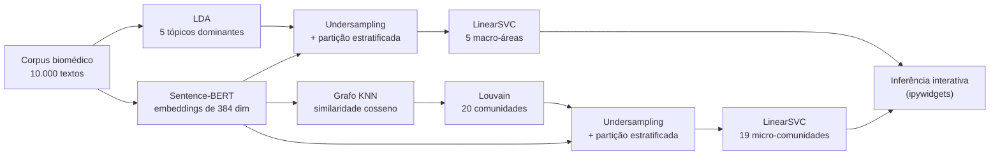
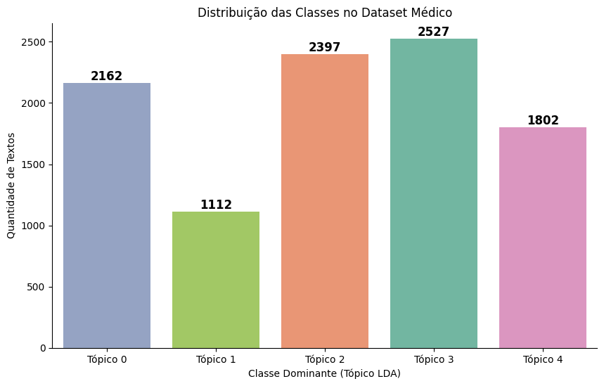
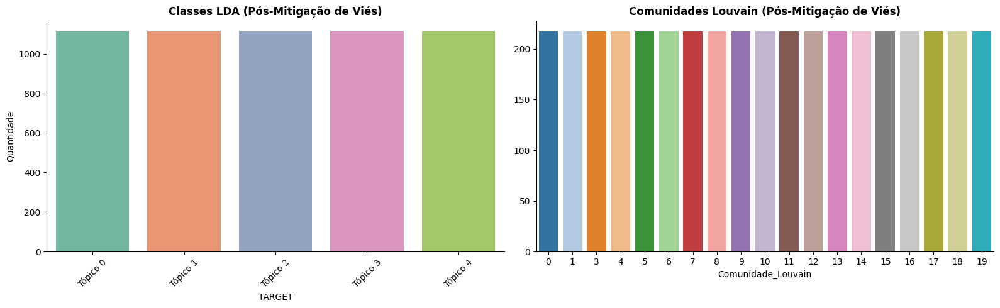
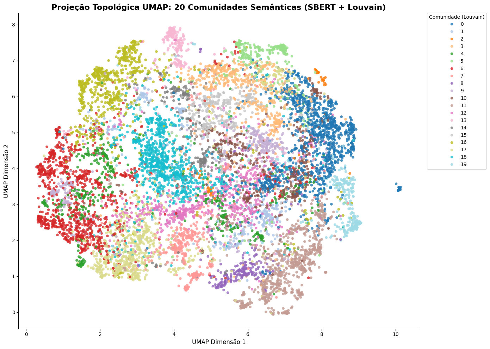
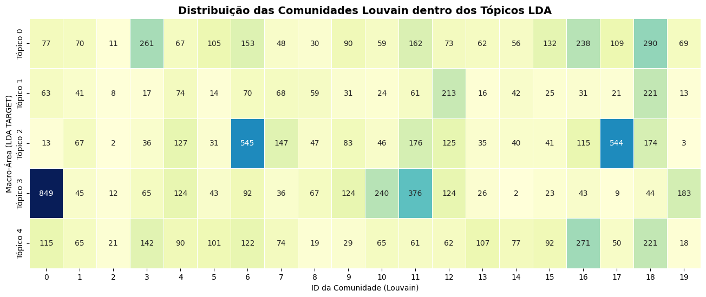
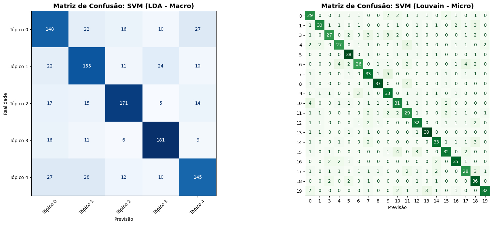

<div align="center">

# 🧬 Projeto de PLN · Healthtec

**Mapeamento topológico e classificação semântica de literatura médica**

Pipeline de NLP que combina *embeddings* densos, modelagem de tópicos e detecção de comunidades em grafos para classificar textos biomédicos de forma hierárquica, com **equidade algorítmica** como requisito de projeto.


[](https://colab.research.google.com/github/miscrapha-DELTA-IA/Projeto-de-PLN-Healthtec/blob/main/TRABALHO_NLP.ipynb)

[Visão geral](#visão-geral) · [Arquitetura](#arquitetura) · [Resultados](#resultados) · [Estrutura](#estrutura-do-repositório) · [Como executar](#como-executar) · [Stack](#stack-tecnológico) · [Contexto acadêmico](#contexto-acadêmico)

</div>

---

## Visão geral

Este repositório implementa um pipeline completo de Processamento de Linguagem Natural (NLP) para a classificação hierárquica de textos no domínio biomédico.

O foco central é a **equidade algorítmica** (*algorithmic fairness*): técnicas estritas de *undersampling* mitigam o viés de representatividade (volume) das classes majoritárias. Com isso, a identificação de especialidades de nicho e doenças raras recebe o mesmo peso preditivo que patologias epidemiologicamente mais frequentes.

| Aspecto | Descrição |
|---|---|
| **Domínio** | Literatura biomédica (textos em inglês) |
| **Corpus** | 10.000 textos |
| **Tarefa** | Classificação hierárquica: 5 macro-áreas → 20 micro-comunidades detectadas (19 no classificador) |
| **Diferencial** | Embeddings densos + topologia de grafos, em vez de Bag-of-Words |
| **Equidade** | *Undersampling* para balanceamento de classes antes do treino |
| **Inferência** | `LinearSVC`, com baixo custo computacional para produção |

## Arquitetura

O pipeline afasta-se de abordagens baseadas exclusivamente em frequência de termos (Bag-of-Words) e propõe uma arquitetura híbrida, que integra espaços vetoriais densos e análise de redes complexas.



| Etapa | Técnica | Resultado |
|---|---|---|
| **1. Vetorização semântica** | Transformer `all-MiniLM-L6-v2` (Sentence-BERT) | Vetores densos de 384 dimensões |
| **2. Macro-áreas** (baseline probabilístico) | Latent Dirichlet Allocation (LDA) | Categorização macro-semântica primária em 5 tópicos |
| **3. Micro-comunidades** (topologia de grafos) | Grafo K-Nearest Neighbors (similaridade cosseno) + algoritmo de Louvain | Agrupamento não supervisionado de nichos clínicos de alta especificidade (ex.: Oncologia Molecular, Nanotecnologia Farmacêutica, Genética Médica) |
| **4. Classificação preditiva** | Support Vector Machine (`LinearSVC`) sobre o espaço dimensional reduzido e balanceado | Inferência com baixo custo computacional em ambiente de produção |

## Resultados

### Diagnóstico e mitigação de viés

O corpus original é desbalanceado: o Tópico 3 tem 2.527 textos, enquanto o Tópico 1 tem apenas 1.112. O *undersampling* equaliza as classes antes do treinamento, de modo que nenhuma macro-área ou comunidade domina a função de perda.

<p align="center">
  
  <br>
  <sub><b>Antes:</b> distribuição das macro-áreas (tópico LDA dominante) no corpus original.</sub>
</p>

<p align="center">
  
  <br>
  <sub><b>Depois:</b> macro-áreas (esquerda) e comunidades Louvain (direita) balanceadas.</sub>
</p>

> [!NOTE]
> O Louvain detectou 20 comunidades, mas a **comunidade 2** (54 textos no corpus completo) não consta no conjunto balanceado. Por isso, o classificador de micro-comunidades opera sobre **19 classes**.

### Topologia semântica

A projeção UMAP dos embeddings, colorida pelas comunidades de Louvain, mostra agrupamentos semânticos coesos, com regiões de transição entre nichos vizinhos.

<p align="center">
  
  <br>
  <sub>Projeção topológica UMAP: 20 comunidades semânticas (SBERT + Louvain).</sub>
</p>

As micro-comunidades refinam as macro-áreas. Por exemplo, a comunidade 0 concentra 849 textos do Tópico 3, e as comunidades 6 e 17 concentram, respectivamente, 545 e 544 textos do Tópico 2.

<p align="center">
  
  <br>
  <sub>Distribuição das comunidades Louvain dentro das macro-áreas LDA (corpus completo).</sub>
</p>

### Desempenho

<p align="center">
  
  <br>
  <sub>Matrizes de confusão no conjunto de teste: SVM (LDA, macro) à esquerda e SVM (Louvain, micro) à direita.</sub>
</p>

| Modelo | Classes | Amostras de teste | Acurácia | Acaso (aleatório) |
|---|:---:|:---:|:---:|:---:|
| SVM · LDA (macro) | 5 | 1.112 | **71,9%** | 20,0% |
| SVM · Louvain (micro) | 19 | 825 | **73,6%** | 5,3% |

Recall por macro-área (SVM · LDA): Tópico 0 = 66,4% · Tópico 1 = 69,8% · Tópico 2 = 77,0% · Tópico 3 = 81,2% · Tópico 4 = 65,3%. O Tópico 1, a classe minoritária no corpus original, atinge desempenho comparável ao das demais. No classificador de micro-comunidades, o recall por comunidade varia de aproximadamente 60% a 89%.

<sub>Métricas calculadas a partir das matrizes de confusão acima; o relatório completo (precisão, recall e F1 por classe) é gerado pelo notebook.</sub>

## Estrutura do repositório

```text
.
├── assets/                          # Figuras exibidas neste README
├── TRABALHO_NLP.ipynb               # Pipeline completo (dados → treino → avaliação → inferência)
├── modelo_svm_lda.pkl               # SVM das 5 macro-áreas
├── modelo_svm_louvain.pkl           # SVM das micro-comunidades (Louvain)
├── perfil_comunidades_louvain.pkl   # Dicionário semântico (TF-IDF) das comunidades
└── README.md
```

| Artefato | Descrição |
|---|---|
| `TRABALHO_NLP.ipynb` | Notebook Jupyter com a implementação integral: aquisição de dados via repositório remoto, geração de embeddings, *undersampling*, treinamento dos modelos, métricas de avaliação multivariada e interface de inferência. |
| `modelo_svm_lda.pkl` | Classificador SVM otimizado para a predição das **5 macro-áreas**. |
| `modelo_svm_louvain.pkl` | Classificador SVM treinado para a predição das **micro-comunidades** topológicas. |
| `perfil_comunidades_louvain.pkl` | Extração de *features* (palavras-chave via TF-IDF) que definem e rotulam dinamicamente cada micro-comunidade detectada. |

## Como executar

[](https://colab.research.google.com/github/miscrapha-DELTA-IA/Projeto-de-PLN-Healthtec/blob/main/TRABALHO_NLP.ipynb)

### Opção A: reprodução integral do pipeline

1. Importe `TRABALHO_NLP.ipynb` em um ambiente **Google Colab**.
2. Selecione **Ambiente de execução → Executar tudo**.
3. O notebook executa automaticamente:
   - a extração do conjunto de dados em formato **Parquet**;
   - o particionamento estratificado;
   - o treinamento dos modelos paramétricos;
   - a plotagem das **Matrizes de Confusão** e dos **Classification Reports**.

### Opção B: validação rápida por inferência interativa

Para validar o modelo com novos textos **sem reprocessar o treinamento**:

1. Abra `TRABALHO_NLP.ipynb` no Google Colab.
2. Faça o upload dos três artefatos serializados (`.pkl`) no diretório local do ambiente.
3. Execute a célula de recarregamento das variáveis:

   ```python
   import joblib

   modelo_macro = joblib.load("modelo_svm_lda.pkl")
   modelo_micro = joblib.load("modelo_svm_louvain.pkl")
   perfil_comunidades = joblib.load("perfil_comunidades_louvain.pkl")
   ```

4. Vá ao final do notebook e execute o bloco **Interface Preditiva Dinâmica**.
5. Use a interface (`ipywidgets`) para submeter resumos clínicos ou relatos médicos originais e inspecionar, em tempo real, a ancoragem semântica processada pelo algoritmo.

> [!NOTE]
> A interface de inferência foi concebida para textos em **inglês**.

<details>
<summary><b>Dependências para ambiente local (opcional)</b></summary>

<br>

O notebook foi concebido para o Google Colab. Para reproduzir em ambiente local com Python 3.10+:

```bash
pip install sentence-transformers scikit-learn networkx python-louvain \
            pandas numpy pyarrow matplotlib seaborn ipywidgets joblib
```

</details>

## Stack tecnológico

| Camada | Tecnologias |
|---|---|
| **Linguagem** | Python 3.10+ |
| **Vetorização e NLP** | `sentence-transformers` (Hugging Face) |
| **Aprendizado de máquina** | `scikit-learn` |
| **Análise de redes** | `networkx`, `python-louvain` (`community`) |
| **Engenharia de dados** | `pandas`, `numpy` |
| **Visualização e interface** | `matplotlib`, `seaborn`, `ipywidgets` |

## Contexto acadêmico

Trabalho desenvolvido como requisito avaliativo da disciplina **Tópicos em Biotecnologia 2**, do **Programa de Pós-Graduação em Biotecnologia (PPGBiotec)** da **Universidade Federal do Delta do Parnaíba (UFDPar)**.

## Autor

**Raphael Di Giorgio** **Aquiles Esaú Da Silva Reis· [@miscrapha-DELTA-IA](https://github.com/miscrapha-DELTA-IA)

---

<div align="center">
<sub>PPGBiotec · UFDPar · Parnaíba, PI</sub>
</div>
